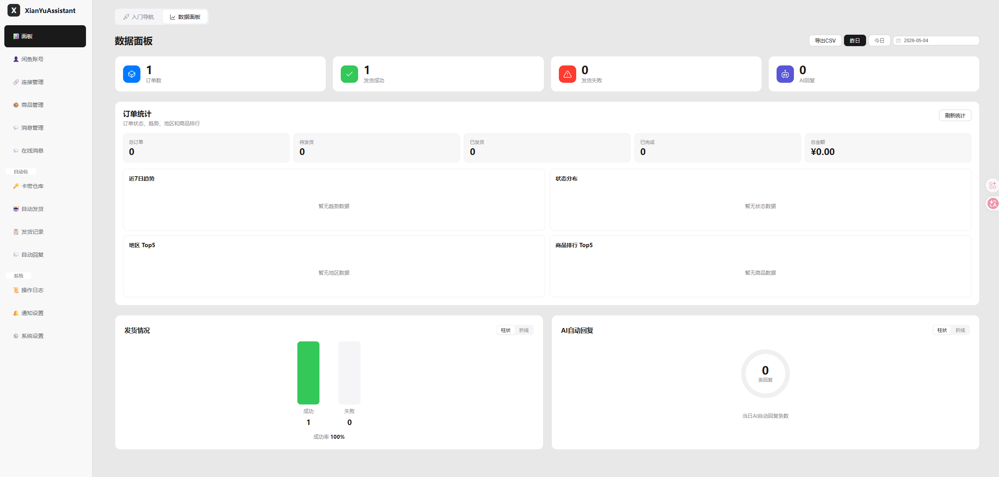
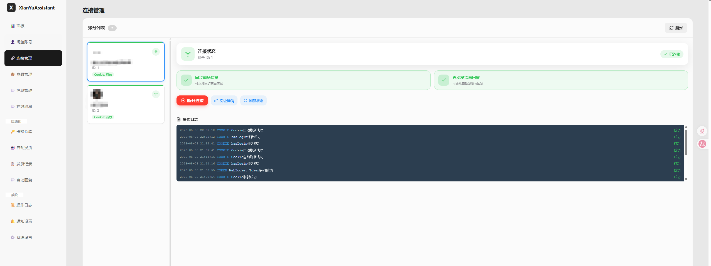
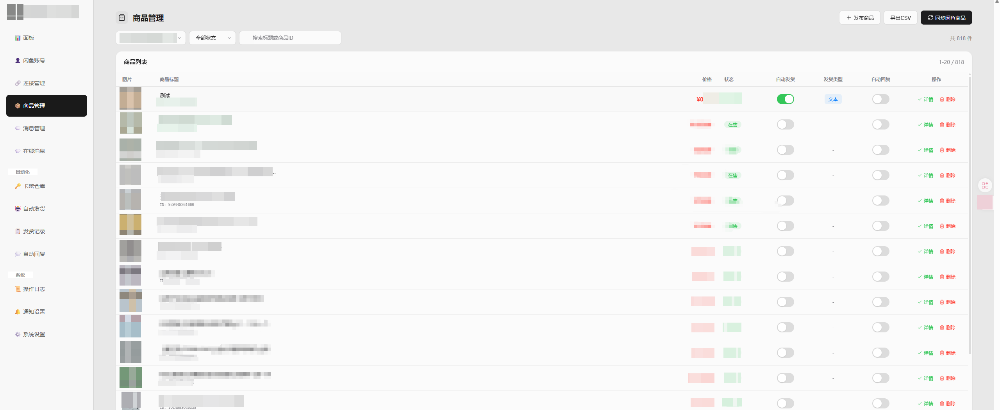
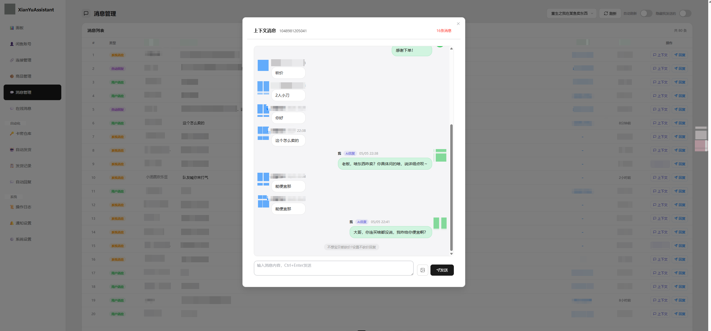
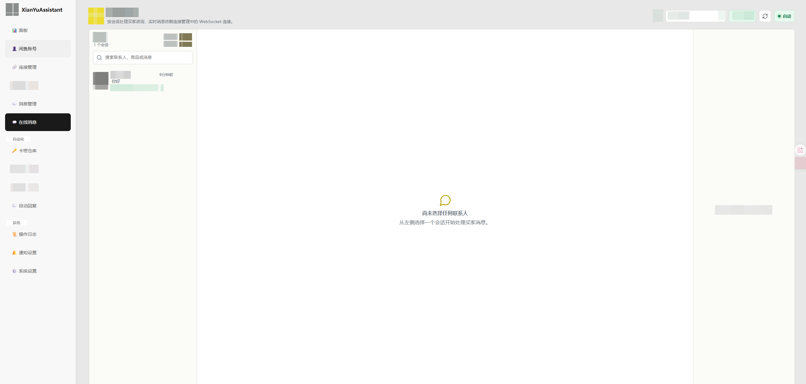
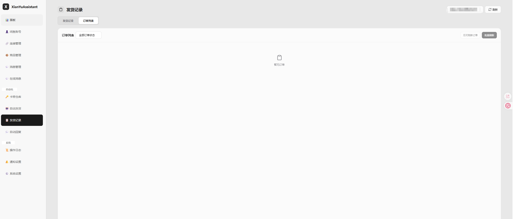
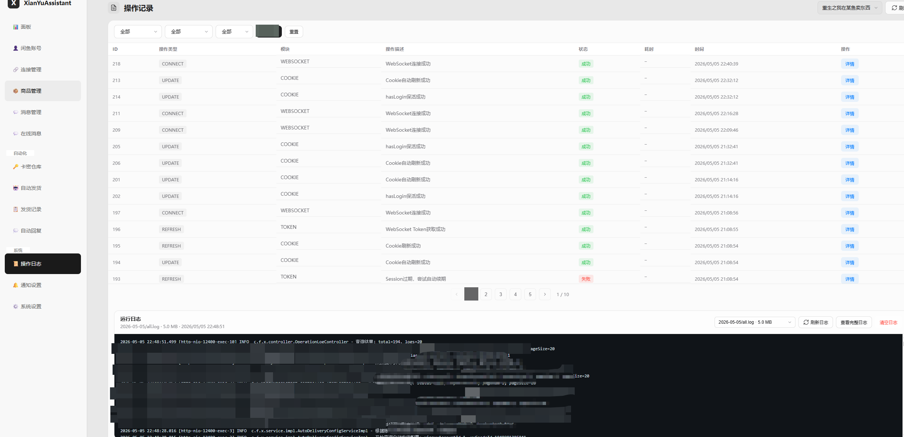
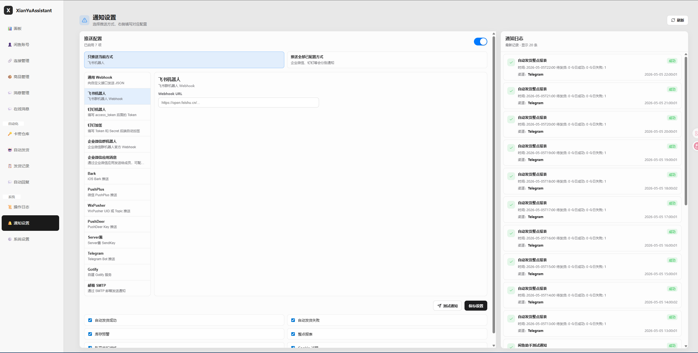
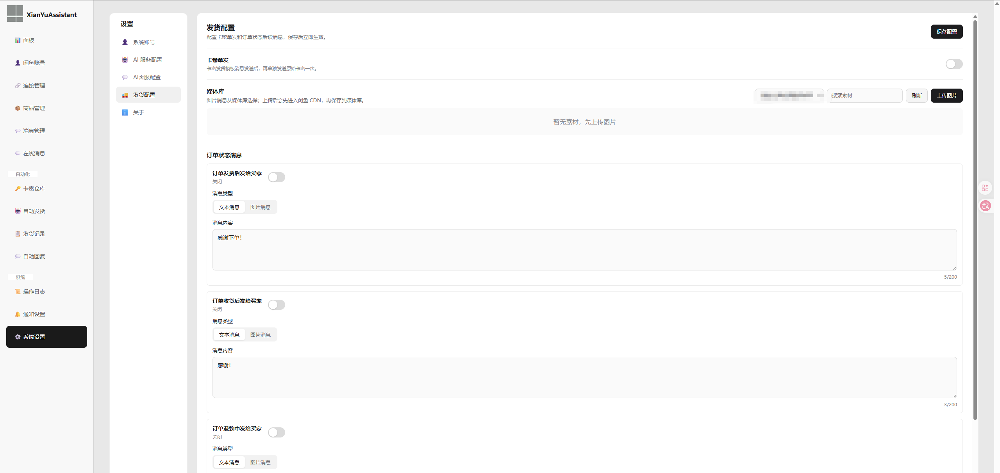

# XianYuAssistant Pro

<div align="center">


基于 XianYuAssistant 二次开发的闲鱼店铺自动化管理工具，重点增强在线消息、自动回复、自动发货、商品管理、通知渠道和移动端体验。

[二开说明](#二开说明) • [更新内容](#更新内容) • [功能特性](#功能特性) • [部署方式](#部署方式) • [使用指南](#使用指南) • [技术栈](#技术栈) • [常见问题](#常见问题)

</div>

---

## 二开说明

本项目为 XianYuAssistant 的二次开发版本，仓库地址：

https://github.com/9Rebels/XianYuAssistant-pro

二开重点：

- 增强多账号运营、在线消息、商品管理、订单管理、自动发货和自动回复体验。
- 扩展 AI 服务配置，支持阿里百炼和通用 OpenAI 兼容接口。
- 优化小屏和大屏布局，提升移动端可用性。

---

## 更新内容

### Pro 增强功能

- 在线消息：新增顶级导航“在线消息”，支持多账号头像切换、实时消息、系统通知会话保留、右下角新消息弹窗、点击进入聊天窗口。
- 消息体验：支持图片上传发送、商品卡片查看详情、大屏右侧展示商品详情、小屏消息旁展示账号头像切换。
- 自动回复：新增账号级全局 AI 回复模板，商品级固定资料只做单品补充；支持关键词规则、通用规则、商品专属规则、默认回复和 AI 回复优先级。
- AI 服务：支持阿里百炼和通用 OpenAI 兼容接口，支持填写域名、`/v1` 或服务商自定义路径，如 `/plan/v3`；支持获取模型、测试连接和选择 AI 回复服务。
- 自动发货：补充多规格、延时发货、防重复处理、多种发货方式、发货统计、自动发货记录和错误抑制逻辑。
- 商品管理：在售商品优先展示，已售出后置；支持商品详情同步、商品固定资料同步、上下架/价格/库存相关管理入口清理。
- 订单管理：保留订单列表、状态同步、批量刷新和订单详情入口，避免误解为纯本地数据。
- 通知渠道：优化通知日志小屏布局，支持展示推送渠道，支持多推送配置时选择全部通知或指定渠道。
- 账号显示：添加账号默认不填备注；所有账号下拉优先显示备注，未设置备注则显示账号名称。
- UI 优化：修复多个小屏溢出、输入框文字遮挡、卡片宽度不足、聊天记录大屏过空等问题。
- Docker/部署：收紧 `.dockerignore`，排除数据库、日志、构建产物、缓存等无用文件；更新本地镜像打包教程。

---

## 📸 截图展示

### 消息管理

查看聊天记录，支持快速回复和消息筛选：

<div align="center">
  
  <p><i>首页-数据面板</i></p>
</div>


### 功能截图

<div align="center">
  
  
  <p><i>连接管理 &nbsp;&nbsp;|&nbsp;&nbsp; 商品管理</i></p>
</div>

<div align="center">
  
  
  <p><i>消息快速回复 &nbsp;&nbsp;|&nbsp;&nbsp; 在线消息</i></p>
</div>

<div align="center">
  
  
  <p><i>订单记录 &nbsp;&nbsp;|&nbsp;&nbsp; 操作日志</i></p>
</div>

<div align="center">
  
  
  <p><i>通知配置 &nbsp;&nbsp;|&nbsp;&nbsp; 发货配置</i></p>
</div>


---

## 📋 功能特性

### 🎯 核心功能

| 功能 | 说明 |
|------|------|
| 📊 **数据面板** | 实时统计账号、商品、订单、消息等核心数据 |
| 👤 **闲鱼账号** | 多账号管理，支持扫码登录，统一管理Cookie和Token |
| 🔗 **连接管理** | WebSocket连接管理，实时监听闲鱼消息，支持Token自动刷新 |
| 📦 **商品管理** | 同步闲鱼商品，配置自动发货、自动回复等功能 |
| 💬 **消息管理** | 查看聊天记录，支持快速回复、发送图片、消息筛选 |

### 🤖 自动化功能

| 功能 | 说明 |
|------|------|
| 🔑 **卡密仓库** | 管理虚拟商品卡密，支持批量导入、自动发货 |
| 🤖 **自动发货** | 买家付款后自动发送发货信息，支持文本、链接、卡密等 |
| 📋 **发货记录** | 查看自动发货历史记录，支持手动重发 |
| 💭 **自动回复** | 智能匹配关键词自动回复，支持精确/模糊/正则匹配 |

### ⚙️ 系统功能

| 功能 | 说明 |
|------|------|
| 📜 **操作日志** | 详细记录所有操作，方便追踪和排查 |
| ⚙️ **系统设置** | 配置AI模型、滑块验证、自定义参数等 |

### ✨ 高级特性

- 🔄 **Token自动刷新** - 智能维护登录状态，随机间隔避免检测
- 🔐 **滑块验证处理** - 智能检测验证需求，提供详细操作指引
- 🤖 **AI智能客服** - 集成通义千问大模型，智能回复买家问题
- 🧠 **RAG知识库** - 按商品维度构建向量知识库，提升AI回复准确性
- 🔌 **自定义发货API** - 支持外部系统对接发货流程
- 📱 **响应式设计** - 完美适配桌面、平板、手机三种设备模式

---

## 🚀 部署方式

### 方式一：Docker部署（推荐）

#### 环境要求
- Docker 20.10+

#### GitHub 自动构建镜像

本仓库已配置 GitHub Actions，代码推送到 `main` / `master` 分支或手动运行 `Docker Build` 工作流后，会自动构建并推送镜像到 GitHub Container Registry：

```text
ghcr.io/9rebels/xianyuassistant-pro:latest
```

国内服务器拉取 GitHub Container Registry 较慢时，可以使用南京大学镜像源：

```text
ghcr.nju.edu.cn/9rebels/xianyuassistant-pro:latest
```

镜像路径只需要替换 registry 域名，标签规则与官方 GHCR 保持一致。

说明：

- `latest`：默认分支构建产物，用于日常部署。
- `sha-xxxxxxx`：每次提交对应的不可变镜像标签，便于回滚。
- `v*` 标签：推送 Git tag，如 `v1.1.4`，会生成对应版本镜像。
- 如果拉取镜像提示无权限，请到 GitHub 仓库的 Packages 页面将镜像可见性设置为 Public。

#### 一键部署脚本

**Linux/Mac**:
```bash
docker run -d \
  --name xianyu-assistant \
  -p 12400:12400 \
  -v $(pwd)/data/dbdata:/app/dbdata \
  -v $(pwd)/data/logs:/app/logs \
  --restart unless-stopped \
  ghcr.io/9rebels/xianyuassistant-pro:latest
```

**Windows PowerShell**:
```powershell
docker run -d `
  --name xianyu-assistant `
  -p 12400:12400 `
  -v ${PWD}/data/dbdata:/app/dbdata `
  -v ${PWD}/data/logs:/app/logs `
  --restart unless-stopped `
  ghcr.io/9rebels/xianyuassistant-pro:latest
```

#### 自定义配置

通过环境变量自定义配置：

```bash
docker run -d \
  --name xianyu-assistant \
  -p 12400:12400 \
  -e JAVA_OPTS="-Xms256m -Xmx512m" \
  -v /your/path/dbdata:/app/dbdata \
  -v /your/path/logs:/app/logs \
  --restart unless-stopped \
  ghcr.io/9rebels/xianyuassistant-pro:latest
```

**配置项说明**:

| 参数 | 默认值 | 说明 |
|------|--------|------|
| `-p 12400:12400` | 12400:12400 | 端口映射（物理机端口:容器端口） |
| `-v /app/dbdata` | - | 数据库数据目录（SQLite + 向量数据库） |
| `-v /app/logs` | - | 应用日志目录 |
| `-e JAVA_OPTS` | -Xms256m -Xmx512m | JVM内存参数 |
| `-e SERVER_PORT` | 12400 | Spring Boot服务端口（容器内部） |

> **数据目录说明**:
> - `dbdata/xianyu_assistant.db` - SQLite数据库（账号、商品、订单、配置等）
> - `dbdata/vectorstore.json` - 向量数据库（AI知识库向量数据）
> - `dbdata/captcha-debug/` - 自动滑块失败和二维码验证截图
> - `logs/xianyu-assistant.log` - 应用运行日志

> ⚠️ **重要提示**:
> - 容器内路径（`/app/dbdata` 和 `/app/logs`）不能修改
> - 自动滑块截图默认写入 `/app/dbdata/captcha-debug`，会随 `data/dbdata` 一起映射到物理机
> - 物理机路径一旦设置不要随意更改，否则会导致数据丢失
> - 升级版本时请使用相同的物理机路径，确保数据正确迁移

#### 常用命令

```bash
# 启动服务
docker start xianyu-assistant

# 停止服务
docker stop xianyu-assistant

# 查看日志
docker logs -f xianyu-assistant

# 重启服务
docker restart xianyu-assistant

# 拉取 GitHub Actions 打包的最新镜像
docker pull ghcr.io/9rebels/xianyuassistant-pro:latest
docker stop xianyu-assistant
docker rm xianyu-assistant
# 然后重新执行 docker run 命令

# 国内服务器可改用南京大学镜像源
docker pull ghcr.nju.edu.cn/9rebels/xianyuassistant-pro:latest
```

#### 访问系统

部署成功后，在浏览器中访问：`http://localhost:12400` 或 `http://你的服务器IP:12400`

---

### 方式二：JAR包部署

#### 环境要求
- Java 21+
- SQLite 3.42.0+

#### 构建JAR包

```bash
# 克隆项目
git clone https://github.com/9Rebels/XianYuAssistant-pro.git
cd XianYuAssistant-pro

# 构建前端
cd vue-code
npm install
npm run build

# 构建后端
cd ..
./mvnw clean package -DskipTests
```

#### 启动服务

```bash
java -jar target/XianYuAssistant-1.1.4.jar
```

#### 自定义配置

```bash
java -Xms256m -Xmx512m -Dserver.port=12400 -jar target/XianYuAssistant-1.1.4.jar
```

#### 访问系统

部署成功后，在浏览器中访问：`http://localhost:12400` 或 `http://你的服务器IP:12400`

---

## 📖 使用指南

### 快速上手

#### 1️⃣ 添加闲鱼账号

- 进入"闲鱼账号"页面
- 点击"扫码登录"按钮
- 使用闲鱼APP扫描二维码
- 等待登录成功

#### 2️⃣ 启动WebSocket连接

- 进入"连接管理"页面
- 选择要连接的账号
- 点击"启动连接"按钮
- 等待连接成功

> ⚠️ **注意**: 如果遇到滑块验证，请按照弹窗提示操作：
> 1. 访问闲鱼IM页面完成验证
> 2. 点击"❓ 如何获取？"按钮查看教程
> 3. 手动更新Cookie和Token

#### 3️⃣ 同步商品信息

- 进入"商品管理"页面
- 选择已连接的账号
- 点击"刷新商品"按钮
- 等待商品同步完成

#### 4️⃣ 配置自动化功能

- 在商品列表中找到目标商品
- 开启"自动发货"或"自动回复"
- 配置发货内容或回复规则
- 保存配置，自动化开始工作

### 功能说明

#### 自动发货

当买家付款后，系统会自动检测到"已付款待发货"消息，并根据配置自动发送发货信息。

**配置步骤**:
1. 进入"自动发货"页面
2. 选择商品
3. 切换到"自动发货"标签页
4. 开启自动发货开关
5. 输入发货内容（支持文本、链接、卡密等）
6. 可选：开启"自动确认发货"
7. 保存配置

#### 自动回复

智能匹配买家消息中的关键词，自动发送预设的回复内容。

**配置步骤**:
1. 进入"自动回复"页面
2. 选择商品，点击"添加规则"
3. 设置关键词和回复内容
4. 选择匹配方式（精确/模糊/正则）
5. 保存规则

#### AI智能客服

集成通义千问大模型，通过RAG知识库实现智能回复。

**配置步骤**:
1. 在系统设置页面配置阿里云 API Key
2. 在AI对话页面上传商品知识库数据
3. 开启AI自动回复

#### Token刷新策略

系统采用随机间隔刷新策略，避免被检测为机器人：

- **Cookie保活**: 每30分钟调用hasLogin接口
- **_m_h5_tk**: 1.5-2.5小时随机刷新
- **websocket_token**: 10-14小时随机刷新
- **账号间隔**: 2-5秒随机

---

## 🛠️ 技术栈

### 后端

| 技术 | 版本 | 用途 |
|------|------|------|
| Java | 21 | 编程语言 |
| Spring Boot | 3.5.7 | 应用框架 |
| MyBatis-Plus | 3.5.5 | ORM框架 |
| SQLite | 3.42.0 | 嵌入式数据库 |
| Java-WebSocket | 1.5.4 | WebSocket客户端 |
| OkHttp | 4.12.0 | HTTP客户端 |
| Gson | 2.10.1 | JSON处理 |
| MessagePack | 0.9.8 | 消息解密 |
| Playwright | 1.40.0 | 浏览器自动化(扫码登录) |
| ZXing | 3.5.3 | 二维码生成 |
| Spring AI | 1.1.4 | AI集成(通义千问+RAG) |

### 前端

| 技术 | 版本 | 用途 |
|------|------|------|
| Vue | 3.5 | 渐进式框架 |
| TypeScript | 5.x | 类型安全 |
| Element Plus | 2.11 | UI组件库 |
| Vite | 7.x | 构建工具 |
| Axios | 1.13 | HTTP客户端 |
| Pinia | 3.0 | 状态管理 |
| Vue Router | 4.6 | 路由管理 |

### 响应式设计

系统支持三种设备模式的自适应布局：

| 设备模式 | 屏幕宽度 | 导航方式 | 特性 |
|---------|---------|---------|------|
| 桌面模式 | > 1024px | 固定侧边栏 | 完整功能展示，侧边栏常驻显示 |
| 平板模式 | 768px - 1024px | 可折叠侧边栏 | 自动折叠侧边栏，点击按钮展开/收起 |
| 手机模式 | < 768px | 抽屉式菜单 | 顶部导航栏 + 全屏抽屉菜单 |

---

## ❓ 常见问题

### 1. WebSocket连接失败怎么办？

**解决方案**:
1. 检查Cookie是否有效
2. 尝试手动更新Token
3. 如果提示需要滑块验证，访问 https://www.goofish.com/im 完成验证后手动更新Cookie和Token

### 2. 如何获取Cookie和Token？

点击连接管理页面中Cookie和Token区域的"❓ 如何获取？"按钮，查看详细的图文教程。

### 3. 自动发货什么时候触发？

当买家付款后，系统会自动检测到"已付款待发货"消息，并根据配置自动发送发货信息。

### 4. Token过期了怎么办？

系统会自动刷新Token（1.5-2.5小时刷新一次），也可以在连接管理页面手动更新。

### 5. 为什么不建议频繁启动/断开连接？

频繁操作容易触发闲鱼的人机验证，导致账号暂时不可用。建议保持连接稳定。

### 6. AI智能客服如何配置？

1. 在系统设置页面配置阿里云 API Key
2. 在AI对话页面上传商品知识库数据
3. 系统将自动使用RAG检索相关知识并生成智能回复

### 7. Docker部署数据存在哪里？

默认存储在容器的 `/app/dbdata` 和 `/app/logs` 目录，通过数据卷映射到物理机。滑块调试截图默认在 `/app/dbdata/captcha-debug`。

**重要提示**:
- ⚠️ 容器内路径（`/app/dbdata` 和 `/app/logs`）不能修改
- ⚠️ 自动滑块失败和二维码验证截图会随 `data/dbdata` 一起保存在物理机
- ⚠️ 物理机路径一旦设置不要随意更改，否则会导致数据丢失
- ⚠️ 升级版本时请使用相同的物理机路径，确保数据正确迁移


## 🤝 贡献指南

欢迎提交 Issue 和 Pull Request。

**当前二开仓库地址**:

- GitHub: https://github.com/9Rebels/XianYuAssistant-pro

---

## 📄 许可证

本项目采用 Apache License 2.0 许可证 - 查看 [LICENSE](LICENSE) 文件了解详情

---

## ⚠️ 免责声明

本项目仅供学习交流使用，请勿用于商业用途。使用本工具产生的任何后果由使用者自行承担。

<div align="center">

**如果这个项目对你有帮助，欢迎 Star 支持。**

</div>

## ⭐ Star History

[](https://star-history.com/#9Rebels/XianYuAssistant-pro)
